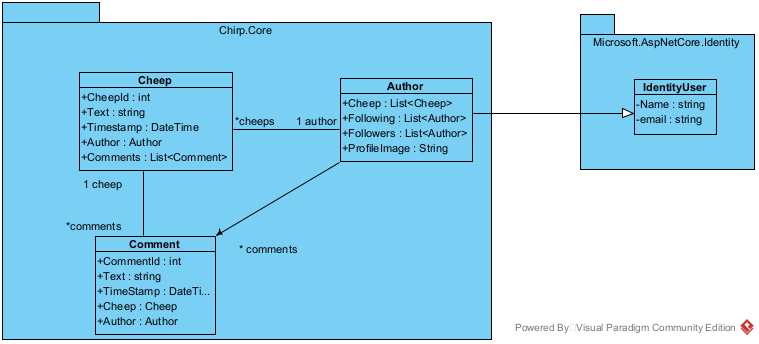
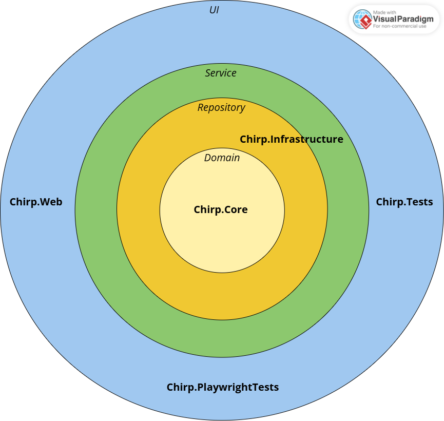
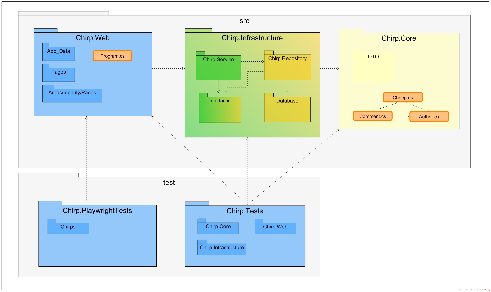
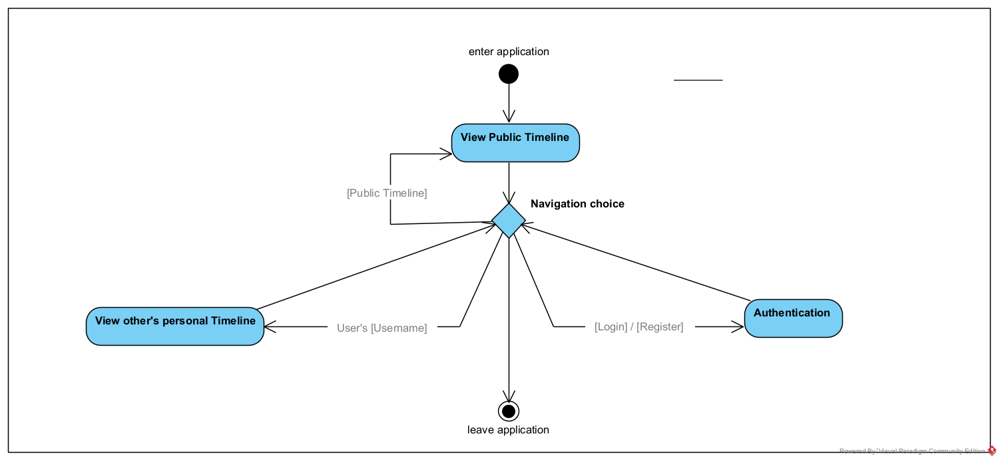
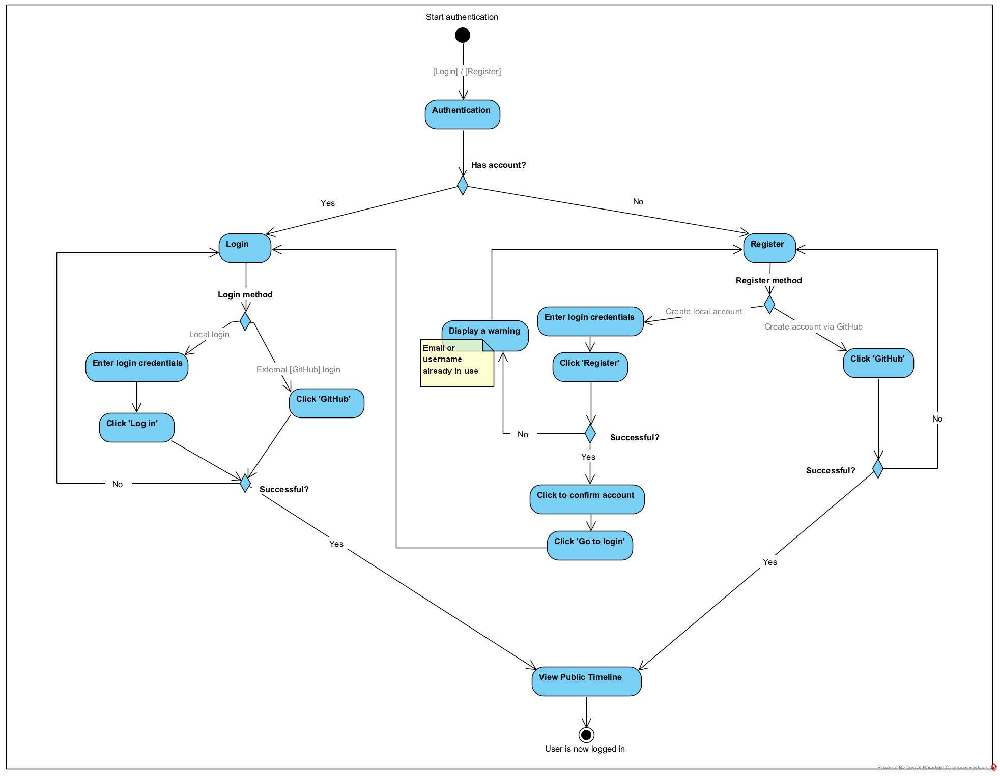
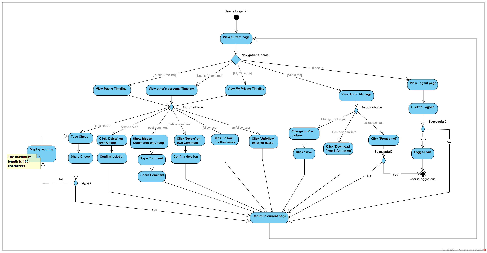
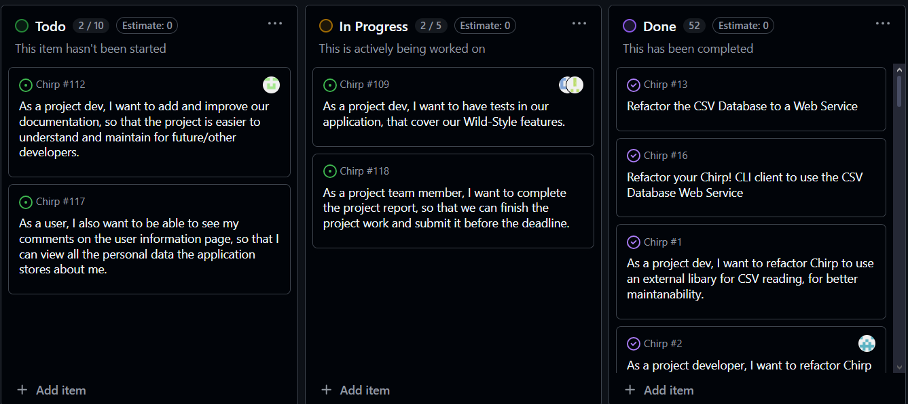

\newpage

# Design and Architecture of _Chirp!_

## Domain model

The domain model of our _Chirp!_ application represent the core concepts of our system. In the project, these are
located in _Chirp.Core_.

The domain consist of three entities: _Author_, _Cheep_ and _Comment_. An author represent a user in the system, who can
create cheeps and comments, follow other authors and be followed. A cheep represent the message posted to our platform
by a author and contains text, a timestamp and the author who created it. A cheep can have multiple comments. A comment 
contains text and are posted by a single author.

In the following diagram, the relation between these entities are clearly modeled through the lines between the entities. An author can create
multiple cheeps, while a cheep only can have one author. A cheep can then also have multiple comments and each comment
are associated to exactly one cheep and author. These relations reflect the core rules and structure of our
application domain.


ASP.NET identity is used for authentication, which is an external part of our program, and therefore illustrated as an
external dependency on the domain model. The _Author_ entity inherits from _IdentityUser_ allowing the domain to 
stay free of any authentication logic. This is also why we have to draw the ASP.NET identity in a package for itself.

In our _Chirp.Core_ folder, we also store our DTO's. These are intentionally omitted from the domain model diagram since
DTO's are not a part of the core domain concepts, but are used for transferring data. 



\newpage

## Architecture — In the small
Our _Chirp!_ application is structured according to the _Onion architecture_ pattern. In other words, 
our system architecture is organized into concentric layers, where external dependencies always point 
inwards, from the outermost layer to the center. The reasoning for using such an architecture design is
that it can make the application easier to maintain and test (i.e. it allows for testing, replacing and
modifying loosely coupled components separately). 

The onion architecture can be divided into the following layers: _domain_, _repository_, _service_ 
and _UI_. In our implementation, these layers are reflected in the structure of the code. 
That is, the application is split into separate projects and directories, namely _Chirp.Core_, 
_Chirp.Infrastructure_, and _Chirp.Web_, as well as a separate test directory containing _Chirp.Tests_ and 
_Chirp.PlaywrightTests_.

{width=80%}

The _domain_ layer is the innermost layer and contains our domain entities, such as _Author_, _Cheep_ and _Comment_ - as well as their 
corresponding DTOs. These do not have any external dependencies, and therefore act as the inner core, _Chirp.Core_, of our application. 
The _repository_ layer is part of _Chirp.Infrastructure_ and is responsible for data access. It handles interaction with the database,
including retrieving, storing, and mapping domain data. The _service_ layer, also located in _Chirp.Infrastructure_, contains the application
services and acts as an intermediary between the UI layer and the repository layer. The UI layer is the outermost layer and is responsible
for the user interface, _Chirp.Web_, and contains the testing infrastructure through _Chirp.Tests_ and _Chirp.PlaywrightTests_.

The following diagram illustrates this structure as a package diagram, where each layer is represented using a distinct color.
Blue represents the _UI_ layer, green the _service_ layer, orange the _repository_ layer, and yellow the _domain_ layer. To keep the diagram
readable and focused on the architectural structure, not all directories and files are shown. It shows how the code is organized across layers 
following the onion architecture, omitting individual inner files, such as for example _AuthorService_, _CommentService_, and _CheepService_ 
within the _Service_ directory. The same applies to the other innermost directories shown in the diagram.  



\newpage

## Architecture of deployed application
The following two diagrams illustrates the deployed architecture of our first version of _Chirp!_ "_Chirp.CLI_", and our final version of _Chirp!_ "_Chirp.Web_".
The diagrams illustrates the communication flow between the user, i.e. client, and the deployed application.


The above diagram show, how _Chirp.CLI_ allows the user to make use of commands to read existing cheeps and post new cheeps, which are sent as HTTPS requests to the backend service. 
The diagram also illustrates the server-side persistence architecture, where the _CSVDBService_ depends on the _SimpleDB_ repository, which in turn persists data in the _chirp_service_db.csv_ file.
This shows how data flows from the client through the server and into storage.


\newpage

The diagram illustrates the deployed architecture of the _Chirp.Web_. Users access the system through a web browser, which communicates with the _Chirp.Web_ 
application hosted on an Azure App Service via HTTPS. The web application is responsible for rendering the user interface and handling incoming HTTP requests.
The application uses EF Core with a SQLite database file (_chirp.db_) for data storage, and supports authentication via GitHub OAuth.
This diagram shows how the client, server, storage, and authentication components interact in the deployed system.
\newpage

## User activities

In the following section, three UML activity diagrams illustrate typical user scenarios and the user journey through our 
_Chirp!_ application, starting from a non-authorized user and ending with an authorized user.

The first diagram shows what a user can do when they are _not logged in_. In this state, the user can view the public 
timeline, view the timelines of other users by clicking on their usernames or decide to authenticate by viewing
the login or register page. 

 

If the user decides to log in, they must choose between logging in with an existing account or registering a new one. 
Both options can be done using either a local account login or an external GitHub login. This is illustrated in the second
diagram. After successful authentication, the user is logged in and returned to the public timeline as an authorized user.

\newpage



The final diagram shows what an authorized user can do, i.e. when the user is _logged in_. An authorized user can view 
the public timeline, view their own timeline, and view the timelines of other users. From each of these, 
the user can follow or unfollow other users, post or delete cheeps, unfold collapsed comments, comment on cheeps, and 
delete their own comments. An authorized user can also choose to view their own personal about-me page or log out of 
the application. From the about-me page, the user can change their profile picture, download their personal information,
or delete their account.  

\newpage



To keep this diagram simple and readable, the action “_Return to current page_” represents that, after completing an 
activity, the user is returned to the page they were previously viewing. For example, if a user posts a cheep while
viewing their own timeline, they will either stay or return to their own timeline once the action is done.

## Sequence of functionality/calls through _Chirp!_

\newpage
# Process

## Build, test, release, and deployment
This UML activity diagram shows the process of building, testing, releasing, and deploying _Chirp!_ to our GitHub and Azure Web App.
In our project, we have three distinct workflows: a _release_ workflow for publishing the application, a _test_ workflow for building
and testing the application, and a _deploy_ workflow for deploying the application to Azure.

{width=43%}

The workflow that is triggered depends on the type of action performed in the repository. A push with a tag named `v*`,
where `*` represents the release version (e.g., `v1.0.1`), triggers the _release_ workflow. Creating a pull request triggers the
_test_ workflow, while accepting and merging a pull request into the main branch triggers both the _test_ and _deploy_ workflows.

Once triggered, each workflow executes its own set of straightforward steps and does not depend on the others.
All workflows follow a similar structure, where they set up, restore and build the project, before handling their respective
independent tasks.

## Team work
### Project Board Status


The screenshot above shows the project board status shortly before hand-in. The board is organized into three columns: *Todo*, *In Progress*, and *Done*, representing the current state of each task.

At the time of hand-in, the majority of tasks have been completed and placed in the _Done_ column. These include major refactorings, maintainability improvements, and completed user stories related to the core functionality of *Chirp!*.

However, a small number of tasks are still, as of now, unresolved:

[Chirp #112](https://github.com/ITU-BDSA2025-GROUP9/Chirp/issues/112) - **Improve and extend documentation** - 
This task concerns further improving and polishing the project documentation. While the most critical documentation is present, additional refinements for long-term maintainability were not completed, before this screenshot was taken.

[Chirp #117](https://github.com/ITU-BDSA2025-GROUP9/Chirp/issues/117) - **Show user comments on the user information page** - This feature would allow users to see all their own comments on their 'about me' page. The functionality was planned but not fully implemented.

\newpage 

Additionally, two tasks were still _In Progress_:

[Chirp #109](https://github.com/ITU-BDSA2025-GROUP9/Chirp/issues/109) - **Add tests for Wild-Style features** - Some tests were implemented during development, but comprehensive coverage of all Wild-Style features have not yet been completed, as these features still need to be covered by Playwright tests.

[Chirp #118](https://github.com/ITU-BDSA2025-GROUP9/Chirp/issues/118) - **Complete the project report** - This issue represents the final writing and polishing of the project report, which was still ongoing at the time, the screenshot was taken.

All core application functionalities have been implemented, while the remaining unresolved tasks mainly concern documentation, additional tests, and minor feature extensions.

### Development workflow


1. **Issue creation** - New work criteria were created as GitHub issues and formulated as short user stories. Each issue described a concrete task, feature, or refactoring goal.

2. **Task planning and prioritization** - Issues were added to the project board and initially placed in the *Todo* column. During planning, tasks were discussed and prioritized based on importance and dependencies.

3. **Development phase** - When work on a task started, the corresponding issue was moved to *In Progress*. Development was performed on a separate *feature branch*, ensuring that unfinished or experimental code did not affect the main branch.

4. **Completion and review** - Once a task was implemented and tested locally, a pull request was made and the corresponding branch was merged into the main branch after a review, ensuring that the main branch always contained a working version of the system. The issue was lastly marked as *Done* on the project board.

Larger tasks (such as refactoring or architectural changes) were sometimes split into smaller follow-up issues. This allowed incremental improvements without blocking overall progress.

\newpage

## How to make _Chirp!_ work locally
This section describes the exact steps needed to get *Chirp!* running on a fresh machine, including required tools, configuration, and what you should expect to see.

### Prerequisites
Before cloning the project, ensure the following tools are installed:

- **Git**
- **.NET SDK 8.0**
- A modern web browser
- *(Optional but recommended)* Visual Studio or Rider

> The application uses **SQLite**, so no external database server is required.


Check that .NET is installed with:

```bash
dotnet --version
```

### Clone the Repository

Open a terminal and execute:

```bash
git clone https://github.com/ITU-BDSA2025-GROUP9/Chirp.git
cd Chirp
```

### Restore Dependencies and Build
From the repository root, run:

``` bash
dotnet restore
dotnet build
```

**Expected outcome**
- All NuGet packages are restored
- The solution builds successfully with no errors


### Trust the HTTPS development certificate (first-time only)
Our *Chirp!* application runs on HTTPS locally. On a fresh machine, trusting the dev cert avoids browser warnings and OAuth callback issues:
```bash
dotnet dev-certs https --trust
```

\newpage

### Configure GitHub OAuth
_Chirp!_ uses GitHub authentication and reads two configuration values:

- `authentication_github_clientId`
- `authentication_github_clientSecret`

These values are required to enable GitHub login. Without them, authentication via GitHub will not be possible.
Including our own development secrets in a public repository is considered a bad practice, therefore, these values are 
not provided. Thus, to enable GitHub authentication in a local environment, a GitHub OAuth App must be created 
and its secrets configured accordingly. Otherwise, GitHub authentication is available 
through our deployed application on Azure.


#### Create a GitHub OAuth App
\
Go to GitHub: 

_Settings → Developer settings → OAuth Apps → New OAuth App_

Create an app with:

- _Homepage URL:_

`https://localhost:xxxx`
(use the HTTPS URL printed in the terminal output)

- _Authorization callback URL:_

`https://localhost:xxxx/signin-github`

Copy the generated Client ID and Client Secret.


#### Set credentials locally using .NET User Secrets
\
From the repository root:
```bash
dotnet user-secrets set "authentication_github_clientId" 
"<CLIENT_ID>" --project src/Chirp.Web

dotnet user-secrets set "authentication_github_clientSecret" 
"<CLIENT_SECRET>" --project src/Chirp.Web
```

*(Optional)* verify secrets:
```bash
dotnet user-secrets list --project src/Chirp.Web
```
Expected output includes:

- `authentication_github_clientId = ...`
- `authentication_github_clientSecret = ...`

\newpage

### Run the web application
From the repository root:

```bash
dotnet run --project src/Chirp.Web
```
Expected terminal output includes that the app is listening on URLs similar to:

- `https://localhost:7140`
- `http://localhost:5198`

Open the HTTPS URL printed in the terminal output.

### What you should see
When the app is running, and you open the site:

- The site loads without a crash.
- You can view pages such as the public timeline.
- You can click Login and authenticate via GitHub.
- After login, you should be redirected back to _Chirp!_.

### Database behavior
Our *Chirp!* application uses SQLite and applies migrations automatically on startup.
A database file is stored under the web project directory:
```bash
src/Chirp.Web/App_Data/chirp.db
```
If the database does not exist, it will be created. If migrations exist, they will be applied automatically.


## How to run test suite locally

# Ethics

## License
We chose an MIT License for our project. An MIT License leaves many opportunities for others to use our project,
while still giving us credit for our work without creating any obligations towards us. We felt this fit the project
best, as it matches the context in which the project was developed. That is, it was created in an educational context,
and we therefore, as a group, believe that others also should be allowed to use, read and learn from our code. 
The license is simple, permissive, and compatible with the dependencies in our _.csproj_ files. For these reasons, 
we consider the MIT License to be the best fit for this project, whereas a more restrictive license would likely 
be more appropriate for an actual commercial product or application.


## LLMs, ChatGPT, CoPilot, and others
During the development of our project, Large Language Models (LLMs) were used for various parts of
the project, primarily ChatGPT. Although LLMs were used throughout the project, we were not always
fully transparent about their use and did not consistently add, for instance, ChatGPT as a co-author
to all commits, where it was actually used. The primary reason for this was that at the beginning of
the project, we were not aware that this was required. Once we were informed and reminded of this,
we began to apply it to our commits. However, there were still instances where we simply forgot to
add it as a co-author, particularly when the use of LLMs was minimal and not a significant part of
the changes in a commit.

The primary use of LLMs during our project was for error handling and debugging. There were many
situations in which we encountered that changes to the code caused significant parts of the
system to break. As a result, we had to identify where the issues had occurred, and how to resolve
them, sometimes while dealing with a large number of exceptions simultaneously. This was not always
straightforward, and LLMs were, therefore, particularly helpful in such situations. In these cases, we
would, for instance, provide ChatGPT with the broken code and the associated exceptions and prompt it
to suggest how to handle these. This was for the most part useful, when frustration had begun to build,
and we could not resolve the issue on our own, as it often provided us with insight into the mistakes
we had made. In many instances, the underlying problems were caused by simple or easily overlooked
coding mistakes. Therefore, the LLMs offered us an additional perspective that helped us resolve
these issues efficiently.

A second use of LLMs was for direct code generation. This was, however, used in moderation and
primarily for inspiration and guidance on more confusing or challenging tasks, allowing us to incorporate
parts of the generated code while still implementing the final solution properly on our own. Lastly, we
also decided to use ChatGPT for image generation, creating the profile pictures in our project that
depict different colored birds. We chose this, because we wanted images that fit the bird-themed concept
of _Chirp!_ while maintaining a clean user interface design, and since none of us had the necessary skills
or time to create these images ourselves, using ChatGPT provided us with a fast and easy solution.

The advantage of LLMs is that they provide a useful tool when one is uncertain or stuck, offering 
guidance on how to handle it, and since they are always available, they can help more quickly than,
for instance, a teaching assistant, who is limited by time and day. Therefore, LLMs can in most cases
speed up the development.

However, LLMs can sometimes also be misleading. We found that, since the LLM lacks full knowledge of
the project that only we as the developers possess, it occasionally provided incorrect guidance, which
slowed our development down rather than speed it up. A significant example of this occurred during
the deployment of our application to Azure. For a long time, we believed that our GitHub Action workflow was the
reason the application would not deploy automatically and display the new content, after integrating
the EF Core database. Following guidance from ChatGPT, we spent considerable time adjusting the
workflow, only to later discover that the actual issue was a missing startup command
and an outdated database in Azure (See [GitHub Issue #24](https://github.com/ITU-BDSA2025-GROUP9/Chirp/issues/24#issue-3454931534)).

In conclusion, we found that LLMs, when used appropriately, can significantly speed up the
development process. However, they should be used in moderation, and while convenient, they
can also introduce inefficiencies if completely and uncritically relied upon. 

\newpage
# Appendix

## Project links

- _GitHub Repository:_ \
[https://github.com/ITU-BDSA2025-GROUP9/Chirp](https://github.com/ITU-BDSA2025-GROUP9/Chirp)

- _Azure Web App:_ \
[https://bdsagroup9chirprazor-ekabaabpd3g4cvg6.swedencentral-01.azurewebsites.net/](https://bdsagroup9chirprazor-ekabaabpd3g4cvg6.swedencentral-01.azurewebsites.net/)
 